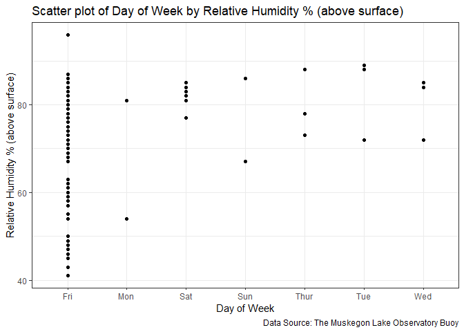
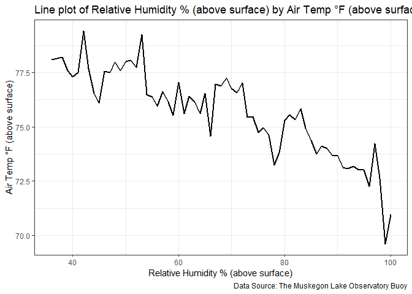
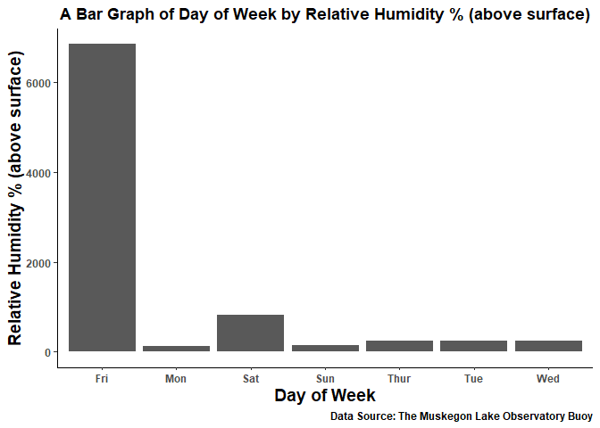
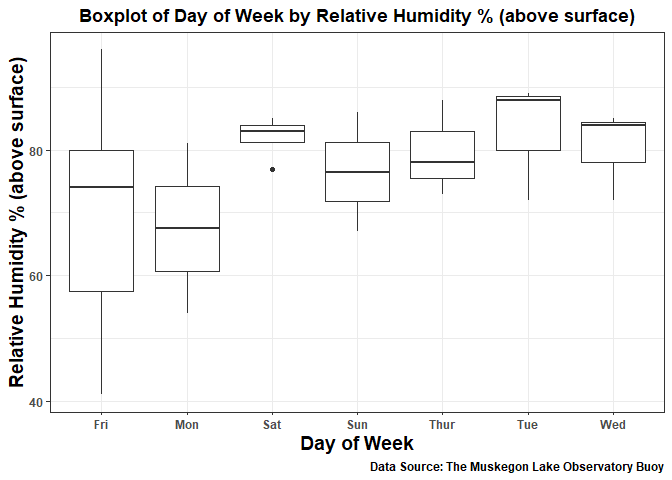

# MLBuoy
Muskegon Lake Buoy

## Description

Grand Valley State University's Robert B. Annis Water Resources Institute (AWRI) established a buoy-based observatory in Muskegon Lake in 2010. The Muskegon Lake Buoy is an important tool for monitoring the conditions of the lake and providing valuable information about the environment. It provides current conditions and historic data of Muskegon Lake in Muskegon County, Michigan going back to 2011, enabling researchers and stakeholders to gain a comprehensive understanding of the lake's ecosystem over time. 

In order to streamline the process of extracting and visualizing data from the Buoy, we have developed an R Package named MLBuoy that employs an Application Programming Interface (API). This package serves as an efficient means for users to access and work with the data, ensuring ease of use and maximum convenience. The package includes a variety of functions and tools that enable users to extact, manipulate, and visualize the data, allowing for in-depth analysis and insights that can inform data-driven decision-making.

The first function, fetch_buoy_data, obtains data on current and historical conditions of Muskegon Lake in Muskegon County, Michigan from the Muskegon Lake Buoy API. The second function, plot_buoy_data, offers a simple method to visualize data obtained from Muskegon Lake Buoy.

## Overview of the package's functions

| Function | Description |
|----------|----------|
| fetch_buoy_data | Extracts and obtains data on current and historical conditions of Muskegon Lake in Muskegon County, Michigan from the Muskegon Lake Buoy API. |
| plot_buoy_data | Retrieves and extracts data from the Muskegon Lake Buoy through the use of an API. The raw data is then transformed into an easy-to-read and visually appealing graph, facilitating comprehension and analysis. |


## Installation

Install the package from [GitHub](https://github.com/) using the code
below:

``` r
if("devtools" %in% installed.packages() == FALSE) {
    install.packages("devtools")
}

devtools::install_github("BNgigi/MLBuoy")
```

# **Function 1: Fetch Muskegon Lake Buoy Data**

The function fetch_buoy_data() is used to retrieve data from the
Muskegon Lake Buoy. It allows the user to obtain valuable information
about the current conditions and historical data of the lake, all
through the convenience of an API. The function provides comprehensive
understanding of the lake’s conditions over time as it grants access to
a wealth of data dating back to 2011.

## **Parameters**

The function takes the following parameters:

| Variable    | Description                                                                                     | Supported_Values                                                                                                                |
|:------------|:------------------------------------------------------------------------------------------------|:--------------------------------------------------------------------------------------------------------------------------------|
| x           | A single x value                                                                                | If no value is specified, date will be used as the default                                                                      |
| y           | At least one y value is required                                                                | Multiple y values should be separated by a comma                                                                                |
| start_date  | A specific date in time that marks the beginning of a particular period                         | Date values must be in the format MM/DD/YYYY or M/D/YY. The default value is 10/01/2022                                         |
| end_date    | A specific date in time that marks the end of a particular period                               | Values must be in the format MM/DD/YYYY or M/D/YY. The default date is 10/31/2022                                               |
| time        | Time values must be in the 24-hour format H:MM or HH:MM.                                        | The values must be divisible by 15 minutes (0:00, 0:15, 0:30, and 0:45). If no value is provided then all times are considered. |
| calculation | The mathematical calculation performed on the range points within an x variable’s concentration | Average, Minimum and Maximum                                                                                                    |

Note: The arguments must use supported values. More information can be
found at Grand Valley State University Muskegon Lake Buoy API website:
<https://www.gvsu.edu/wri/buoy/data-api.htm>

## **Function Output**

The Fetch Muskegon Lake Buoy Data function returns a data frame based on
the provided parameters.

## **Required Libraries**

Before using the Fetch Muskegon Lake Buoy Data function, you must import
tidyverse library.

## **Example**

Here is an example of how to use the Fetch Muskegon Lake Buoy Data
function:

``` r
# Load the MLBuoy library and the tidyverse package
library(MLBuoy)
library(tidyverse)

# Fetch buoy data with specific parameters
buoyData <- fetch_buoy_data(x="weekday", y="atmp1,tp001,tp002", start_date="7/7/11", end_date="7/28/11")

# Display the first 12 rows of the buoy data in a table format
knitr::kable(head(buoyData, n = 12))
```

| x_weekday | y_atmp1 | y_tp001 | y_tp002 | date       |
|----------:|--------:|--------:|--------:|:-----------|
|         5 |   68.00 |   76.96 |   76.96 | 0011-07-28 |
|         5 |      NA |      NA |      NA | 0011-07-28 |
|         5 |      NA |      NA |      NA | 0011-07-28 |
|         5 |   67.46 |   77.09 |   76.86 | 0011-07-28 |
|         5 |      NA |      NA |      NA | 0011-07-28 |
|         5 |      NA |      NA |      NA | 0011-07-28 |
|         5 |   66.92 |   76.96 |   76.86 | 0011-07-28 |
|         5 |      NA |      NA |      NA | 0011-07-28 |
|         5 |      NA |      NA |      NA | 0011-07-28 |
|         5 |   66.20 |   76.96 |   76.86 | 0011-07-28 |
|         5 |      NA |      NA |      NA | 0011-07-28 |
|         5 |      NA |      NA |      NA | 0011-07-28 |

In this example, we are utilizing the fetch_buoy_data() function to
retrieve data for atmp1, tp001, and tp002 for each day of the week
within the time frame of July 7, 2011 to July 28, 2011.

# **Function 2: Plot Muskegon Lake Buoy Data**

plot_buoy_data() function is designed to retrieve and extract data from
the Muskegon Lake Buoy through the use of an API. The raw data is then transformed into an easy-to-read
and visually appealing graph, facilitating comprehension and analysis.

## **Parameters**

The function takes the following parameters:

| Variable   | Description                                                                                                                                                       |
|:-----------|:------------------------------------------------------------------------------------------------------------------------------------------------------------------|
| x          | The values to be plotted on the x-axis of the graph. If no value is specified, date will be used as the default.                                                  |
| y          | The values to be used on the y-axis of the graph. Multiple y values should be separated by a comma.                                                               |
| start_date | A specific date in time that marks the beginning of a particular period. Date values must be in the format MM/DD/YYYY or M/D/YY. The default value is 10/01/2022. |
| end_date   | A specific date in time that marks the end of a particular period. Values must be in the format MM/DD/YYYY or M/D/YY. The default date is 10/31/2022.             |
| graph_type | The type of chart to be plotted. The supported types are scatter, line, bar, and boxplot.                                                                         |

Note: The arguments for x and y must be supported values. For more
information, please visit the Grand Valley State University Muskegon
Lake Buoy API website: <https://www.gvsu.edu/wri/buoy/data-api.htm>

## **Function Output**

The Plot Muskegon Lake Buoy Data function returns a graph of x values by
y values.

## **Importing Required Libraries**

Before using the Plot Muskegon Lake Buoy Data function, you must import
tidyverse library.

## **Function Usage**

The following is an example of how to use the Plot Muskegon Lake Buoy
Data function.

We will be utilizing the plot_buoy_data() function from the MLBuoy
library to create different types of visualizations. Specifically, we
will be generating a scatter plot, line plot, bar plot, and box plot.

To get started, we need to load the MLBuoy library and the tidyverse
package:

``` r
# Load the MLBuoy library and the tidyverse package
library(MLBuoy)
library(tidyverse)
```

Next, we will generate a scatter plot using the plot_buoy_data function.
The x parameter is set to “weekday” and the y parameter is set to “rh1”,
representing the weekday and relative humidity variables, respectively.
We also specify the start date as “7/7/11” and the end date as
“7/28/11”. Lastly, we set graph_type to “scatter” to generate a scatter
plot.

``` r
# Generate a scatter plot of relative humidity vs. time of day
plot_buoy_data(x = "weekday", y = "rh1", start_date = "7/7/11", end_date = "7/28/11", graph_type = "scatter")
```

<!-- -->

Next, we create a line plot using plot_buoy_data() to visualize the
change in relative humidity by air temperature. We specified x = “rh1”
and y = “atmp1” and set start_date and end_date to “7/7/11” and
“7/28/11”, respectively, to limit the data to the specified time period.

``` r
# Create a line plot of air temperature (y) by relative humidity (x) between 7/7/11 and 7/28/11
plot_buoy_data(x = "rh1", y = "atmp1", start_date = "7/7/11", end_date = "7/28/11", graph_type = "line")
```

<!-- -->

We can also generate a bar plot by setting graph_type to “bar”:

``` r
# Generate a bar plot of relative humidity vs. weekday
plot_buoy_data(x = "weekday", y = "rh1", start_date = "7/7/11", end_date = "7/28/11", graph_type = "bar")
```

<!-- -->

Finally, we can generate a box plot by setting graph_type to “boxplot”:

``` r
# Generate a box plot of relative humidity vs. weekday
plot_buoy_data(x = "weekday", y = "rh1", start_date = "7/7/11", end_date = "7/28/11", graph_type = "boxplot")
```

<!-- -->

# **Package Development**

The MLBuoy R Package was developed by Beatrice Ngigi and Andrew
DiLernia.

# References

Biddanda, B., S. Kendall, A. Weinke, I. Stone, N. Dugener, and S.
Ruberg. Muskegon Lake Observatory Buoy Data: Muskegon Lake, Michigan,
USA: 2011-2022. (www.gvsu.edu/buoy) Time Series Data accessed: 7 April,
2023.
